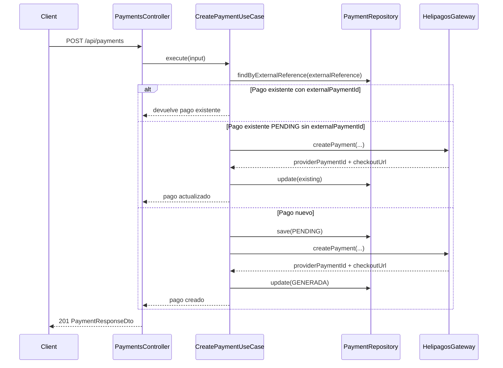
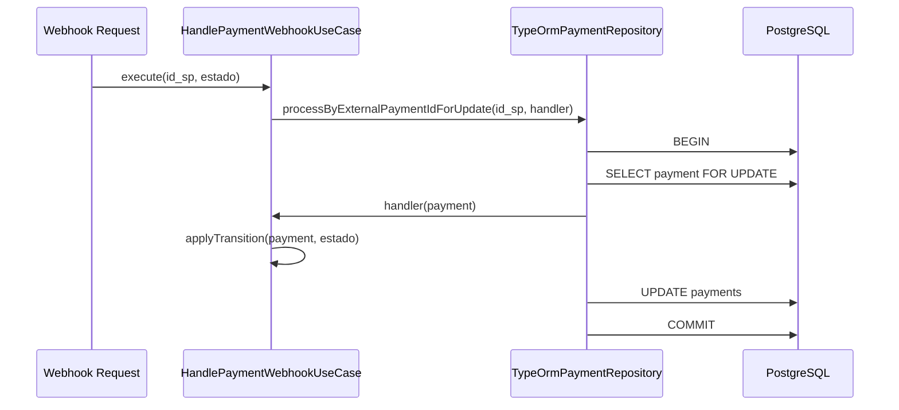

# DESIGN.md — Helipagos Payments API

## 1. Objetivo del diseño

Este proyecto implementa un microservicio backend que actúa como integrador entre clientes externos y la API sandbox de Helipagos.

La solución expone una API REST propia para:

- crear solicitudes de pago;
- consultar solicitudes;
- cancelar solicitudes;
- recibir webhooks de actualización de estado;
- persistir un estado local auditable;
- tolerar fallas del proveedor sin dejar pagos imposibles de recuperar;
- procesar webhooks concurrentes sin pérdida de datos ni condiciones de carrera.

No se implementó frontend porque la consigna no lo requiere y el foco de evaluación está en backend, integración, resiliencia, persistencia, testing y documentación.

---

## 2. Resumen de decisiones principales

| Decisión | Motivo |
|---|---|
| NestJS + TypeScript | Buen soporte para DI, módulos, guards, pipes, filters, testing y Swagger. |
| Arquitectura por capas | Separar presentación, aplicación, dominio e infraestructura. |
| Puertos y adaptadores | Los casos de uso dependen de abstracciones, no de TypeORM ni Axios. |
| PostgreSQL + TypeORM | Persistencia robusta, locks transaccionales y migraciones explícitas. |
| `amount` en centavos | Evita errores de precisión decimal y respeta el contrato de Helipagos. |
| `externalReference` idempotente | Evita duplicados ante doble creación del mismo pago. |
| Pago local `PENDING` recuperable | Permite reintentar si Helipagos falla después de crear el registro local. |
| `WEBHOOK_URL` server-controlled | Evita errores manuales al enviar la URL del webhook a Helipagos. |
| Webhook público sin JWT | Helipagos debe poder invocarlo externamente. |
| Webhook protegido con `apikey` | Alineado con la documentación de Helipagos. |
| Webhook responde 200 ante casos controlados | Evita reintentos innecesarios del proveedor. |
| Lock pesimista en webhook | Protege transiciones concurrentes del mismo pago. |
| Errores tipados + filtro global | Respuestas HTTP consistentes y sin stack traces. |
| Bootstrap de migraciones | Permite inicializar o baselinar DBs de producción de forma segura. |
| JWT simple sin refresh token | Suma protección básica sin ampliar innecesariamente el alcance de la prueba. |

---

## 3. Arquitectura general

La solución sigue una arquitectura por capas inspirada en Clean Architecture / Hexagonal Architecture.

```txt
src/
  contexts/
    auth/
    health/
    payments/
      domain/
      application/
      infrastructure/
      presentation/
    shared/
  database/
    migrations/
    seeds/
    scripts/
```

La dependencia fluye hacia adentro:

```txt
presentation → application → domain
infrastructure → domain/application contracts
```

Los casos de uso no conocen Nest controllers, HTTP, Axios, TypeORM ni detalles concretos de Helipagos. La infraestructura implementa los contratos definidos en dominio.

---

## 3.1 Diagramas de secuencia

Los diagramas de los flujos principales se mantienen en un archivo separado para no sobrecargar este documento:

```txt
docs/SEQUENCE_DIAGRAMS.md
```

Ahí se documentan:

- creación exitosa de pago;
- creación idempotente y recuperación de pagos `PENDING`;
- fallas de Helipagos durante creación;
- webhook válido con `apikey`;
- webhooks inválidos, desconocidos o duplicados;
- cancelación;
- consulta por ID interno;
- lookup local;
- health checks.

Se eligió Mermaid porque GitHub lo renderiza directamente desde Markdown y permite mantener los diagramas versionados como texto.

---

## 4. Separación por capas

### 4.1 Presentation layer

Ubicación principal:

```txt
src/contexts/payments/presentation
```

Responsabilidades:

- exponer endpoints REST;
- validar DTOs con `class-validator`;
- documentar Swagger;
- leer configuración de alto nivel cuando corresponde;
- delegar comportamiento a casos de uso;
- no contener reglas de negocio.

Controlador principal:

```txt
PaymentsController
```

Endpoints principales:

| Método | Endpoint | Descripción |
|---|---|---|
| `POST` | `/api/payments` | Crear pago. |
| `GET` | `/api/payments/:id` | Consultar pago por ID interno. |
| `GET` | `/api/payments/lookup` | Consultar pago local por `externalReference` o `externalPaymentId`. |
| `DELETE` | `/api/payments/:id` | Cancelar pago. |
| `POST` | `/api/payments/webhook` | Recibir webhook de Helipagos. |

---

### 4.2 Application layer

Ubicación:

```txt
src/contexts/payments/application
```

Responsabilidades:

- coordinar casos de uso;
- aplicar flujos de aplicación;
- llamar a puertos abstractos (`PaymentRepository`, `PaymentProviderGateway`);
- no depender de implementaciones concretas.

Casos de uso principales:

| Caso de uso | Responsabilidad |
|---|---|
| `CreatePaymentUseCase` | Crear pago, manejar idempotencia y recuperación de `PENDING`. |
| `GetPaymentUseCase` | Consultar pago local y estado del proveedor cuando corresponde. |
| `CancelPaymentUseCase` | Cancelar local/proveedor según estado. |
| `HandlePaymentWebhookUseCase` | Procesar eventos de Helipagos de forma tolerante y concurrente. |
| `LookupPaymentUseCase` | Buscar estado local por referencia externa o ID de proveedor. |

---

### 4.3 Domain layer

Ubicación:

```txt
src/contexts/payments/domain
```

Responsabilidades:

- reglas de negocio;
- entidad `Payment`;
- estados válidos;
- excepciones de dominio;
- contratos abstractos.

La entidad `Payment` concentra transiciones de estado:

- `markAsCreated`
- `markAsProcessed`
- `markAsAccredited`
- `cancel`
- `expire`
- `reject`
- `chargeback`

Esto evita que las reglas queden dispersas en controllers, repositorios o clientes HTTP.

---

### 4.4 Infrastructure layer

Ubicación:

```txt
src/contexts/payments/infrastructure
```

Responsabilidades:

- integración HTTP con Helipagos;
- implementación TypeORM del repositorio;
- mapeo entre modelos externos, ORM y dominio;
- transacciones y locks de base de datos.

Componentes principales:

| Componente | Rol |
|---|---|
| `HelipagosHttpClient` | Cliente HTTP bajo nivel contra sandbox. |
| `HelipagosGateway` | Adaptador que traduce contrato de dominio ↔ contrato Helipagos. |
| `TypeOrmPaymentRepository` | Implementación de persistencia y transacciones. |
| `PaymentOrmEntity` | Modelo ORM de la tabla `payments`. |

---

## 5. Flujo de creación de pago

El flujo resumido se muestra a continuación. Los diagramas más detallados, incluyendo recuperación de `PENDING` y errores del proveedor, están en `docs/SEQUENCE_DIAGRAMS.md`.



### 5.1 Por qué se crea primero `PENDING`

El pago se persiste localmente como `PENDING` antes de llamar a Helipagos. Esta decisión crea un registro idempotente antes de interactuar con el proveedor.

Si Helipagos falla por timeout, 5xx, credencial inválida o red, el pago queda en estado `PENDING` con `externalPaymentId = null`. Esto no se considera inconsistencia: es un intento incompleto y recuperable.

Un nuevo `POST /api/payments` con la misma `externalReference` reutiliza ese registro y reintenta la creación contra Helipagos, evitando duplicados locales.

---

## 6. Idempotencia

La idempotencia se implementa mediante `externalReference`.

Reglas:

1. `externalReference` es único en base de datos.
2. Si ya existe un pago con `externalPaymentId`, se devuelve el pago existente sin llamar otra vez a Helipagos.
3. Si existe un pago `PENDING` sin `externalPaymentId`, se interpreta como intento previo incompleto y se reintenta contra Helipagos.
4. No se crea un segundo pago local con la misma referencia.

Esto cubre el escenario de doble creación con la misma `referencia_externa` y protege contra clicks duplicados, retries HTTP del cliente o fallas intermedias.

---

## 7. Consistencia ante fallas del proveedor

Una transacción distribuida real entre PostgreSQL y Helipagos no es posible, porque Helipagos es un sistema externo y no participa en una transacción local.

Por eso se eligió una estrategia de consistencia recuperable:

```txt
PENDING local → llamada Helipagos → actualización local GENERADA
```

Si la llamada a Helipagos falla antes de que exista un ID de proveedor, queda un registro `PENDING` recuperable.

Ventajas:

- no se pierde la intención de pago;
- no se duplica el registro local;
- el cliente puede reintentar con la misma `externalReference`;
- se mantiene trazabilidad del intento;
- se evita retornar un estado falso de éxito.

Casos contemplados:

| Falla | Resultado |
|---|---|
| Timeout / red / 5xx | HTTP 503 controlado, pago local `PENDING`. |
| Bearer inválido / 401 / 403 | HTTP 503 controlado, pago local `PENDING`. |
| 400 / 422 del proveedor | HTTP 502 controlado. |
| Error inesperado | HTTP 500 genérico, sin stack trace al cliente. |

### Trade-off reconocido

Si Helipagos llegara a crear el pago pero la respuesta se pierde por timeout, el backend podría no recibir el `externalPaymentId`. En ese caso, al reintentar depende de si Helipagos trata `referencia_externa` como idempotente o rechaza duplicados. Para una implementación productiva completa se podría agregar conciliación posterior por `referencia_externa` si el proveedor expone una API adecuada.

Para el alcance de la prueba, la solución mantiene el estado local recuperable y evita inconsistencias locales irreversibles.

---

## 8. Integración con Helipagos

El contrato interno del dominio usa nombres expresivos en inglés/camelCase. El contrato externo de Helipagos usa snake_case.

La traducción se concentra en `HelipagosGateway` y `HelipagosHttpClient`.

### 8.1 Crear pago

Endpoint Helipagos:

```txt
POST /api/solicitud_pago/v1/checkout/solicitud_pago
```

Mapeo principal:

| Dominio/API propia | Helipagos |
|---|---|
| `amount` | `importe` |
| `expirationDate` | `fecha_vto` |
| `description` | `descripcion` |
| `externalReference` | `referencia_externa` |
| `redirectUrl` | `url_redirect` |
| `webhookUrl` / `WEBHOOK_URL` | `webhook` |
| `surcharge` | `recargo` |
| `secondExpirationDate` | `fecha_2do_vto` |
| `secondaryReference` | `referencia_externa_2` |

### 8.2 Consultar pago

Endpoint Helipagos:

```txt
/api/solicitud_pago/v1/get_solicitud_pago?id={id}
```

`GET /api/payments/:id` consulta el proveedor si el pago local ya tiene `externalPaymentId`, de modo que puede reflejar el estado vivo reportado por Helipagos.

### 8.3 Cancelar pago

Endpoint Helipagos:

```txt
/api/solicitud_pago/v1/checkout/cancelacion_solicitud_pago?id={id}
```

La API propia expone:

```txt
DELETE /api/payments/:id
```

Esto alinea la API pública con la consigna técnica.

---

## 9. URL de webhook controlada por servidor

Aunque el request body permite `webhookUrl`, en producción se prioriza la variable de entorno:

```env
WEBHOOK_URL=https://helipagos-payments-production.up.railway.app/api/payments/webhook
```

Motivo: evitar que un cliente, Swagger o Postman envíe una URL incorrecta como `/webhooks` en vez de `/webhook`.

Regla:

1. Si `WEBHOOK_URL` está configurada, se usa esa URL para la llamada a Helipagos.
2. Si `WEBHOOK_URL` no está configurada, se usa `dto.webhookUrl` como fallback.

Esto hace que la URL crítica de notificación sea una configuración del backend y no un dato frágil ingresado manualmente.

---

## 10. Webhook

Endpoint:

```txt
POST /api/payments/webhook
```

El webhook es público porque Helipagos debe poder invocarlo sin JWT.

### 10.1 Autenticación del webhook

Helipagos documenta el header `apikey` para las notificaciones. Por eso el backend valida:

```env
HELIPAGOS_WEBHOOK_SECRET=...
HELIPAGOS_WEBHOOK_SECRET_HEADER=apikey
HELIPAGOS_WEBHOOK_SECRET_REQUIRED=true
```

Reglas:

| Caso | HTTP | Procesa evento |
|---|---:|---|
| Secret no configurado | 200 | Sí, sin validación. |
| `apikey` correcto | 200 | Sí. |
| `apikey` incorrecto | 200 | No. |
| `apikey` ausente y `REQUIRED=true` | 200 | No. |
| `apikey` ausente y `REQUIRED=false` | 200 | Sí, modo compatibilidad. |

El Bearer token de Helipagos no se usa para validar webhooks. Ese token se usa exclusivamente para llamadas salientes del backend hacia Helipagos.

---

### 10.2 Contrato HTTP del webhook

El webhook responde HTTP 200 en casos controlados para evitar reintentos innecesarios del proveedor.

Casos controlados:

- pago no encontrado para `id_sp`;
- estado desconocido;
- transición duplicada;
- transición fuera de orden;
- `apikey` inválido;
- ausencia de `apikey` si está requerido.

Únicamente un body inválido de acuerdo al DTO puede devolver HTTP 400.

---

### 10.3 Procesamiento de estados

El webhook recibe `estado` desde Helipagos y lo traduce a transiciones de dominio.

| Estado Helipagos | Acción local |
|---|---|
| `PROCESADA` | `markAsProcessed()` |
| `ACREDITADA` | `markAsAccredited()` |
| `VENCIDA` | `expire()` |
| `ANULADA` | `reject()` |
| `RECHAZADA` | `reject()` |
| `DEVUELTA` | `chargeback()` |
| `CONTRACARGO` | `chargeback()` |
| Desconocido | Se ignora y se registra warning. |

Los estados desconocidos no fallan para mantener compatibilidad futura si el proveedor agrega nuevos estados.

---

## 11. Concurrencia del webhook

El diagrama completo del webhook válido y de los casos ignorados está en `docs/SEQUENCE_DIAGRAMS.md`.

El escenario de mayor riesgo es recibir múltiples webhooks concurrentes del mismo pago.

Ejemplo:

```txt
Webhook A: PROCESADA
Webhook B: PROCESADA
Webhook C: ACREDITADA
```

Sin protección, dos requests podrían leer el mismo estado viejo y escribir transiciones inconsistentes.

### 11.1 Estrategia elegida

Se implementó un método transaccional en `PaymentRepository`:

```txt
processByExternalPaymentIdForUpdate(externalPaymentId, handler)
```

Implementación TypeORM:

1. Abre una transacción.
2. Busca el pago por `externalPaymentId`.
3. Aplica `pessimistic_write` lock (`SELECT ... FOR UPDATE`).
4. Mapea ORM → dominio.
5. Ejecuta el handler de transición de dominio.
6. Si el handler indica que hubo cambio, persiste dentro de la misma transacción.
7. Confirma o revierte automáticamente.



Esta estrategia mantiene la lectura, transición y escritura dentro de la misma transacción, evitando race conditions y lost updates.

### 11.2 Resultado de stress

Se validó con Artillery contra Railway:

- 480 requests;
- 480 HTTP 200;
- 0 VUs fallidos;
- p95 aproximado: 228 ms;
- p99 aproximado: 237 ms.

El archivo `webhook-stress.yml` contiene escenarios válidos, duplicados, `id_sp` desconocido, estado desconocido, `apikey` inválido y ausencia de `apikey`.

---

## 12. Modelo de dominio

Entidad principal:

```txt
Payment
```

Campos principales:

- `id`: UUID interno.
- `externalPaymentId`: ID de Helipagos (`id_sp`). Puede ser `null` si el pago aún está `PENDING`.
- `externalReference`: referencia única del comercio.
- `amount`: importe en centavos.
- `description`.
- `status`.
- `expirationDate`.
- `checkoutUrl`.
- `shortUrl`.
- `barCode`.
- `createdAt`.
- `updatedAt`.

Estados:

```txt
PENDING
GENERADA
PROCESADA
ACREDITADA
DEVUELTA
VENCIDA
ANULADA
RECHAZADA
CONTRACARGO
```

### 12.1 Reglas de transición

Algunas reglas relevantes:

- `markAsCreated` solo desde `PENDING`.
- `markAsProcessed` solo desde `GENERADA`.
- `markAsAccredited` solo desde `PROCESADA`.
- `cancel` no permite cancelar pagos `PROCESADA` o `ACREDITADA`.
- estados terminales bloquean transiciones comunes posteriores.
- transiciones idempotentes al mismo estado retornan sin error.

Las violaciones se expresan con `PaymentDomainError` y son convertidas en respuestas controladas fuera del webhook, o warnings dentro del webhook.

---

## 13. Persistencia

Tabla principal:

```txt
payments
```

Campos esperados:

```txt
id
external_payment_id
external_reference
amount
description
status
expiration_date
checkout_url
short_url
bar_code
created_at
updated_at
```

Restricciones principales:

- `external_reference` único.
- índice único parcial sobre `external_payment_id` cuando no es `null`.

El índice parcial permite muchos pagos `PENDING` con `externalPaymentId = null`, pero evita dos pagos locales asociados al mismo `id_sp` una vez que Helipagos asigna ID.

---

## 14. Migraciones y bootstrap

Se usan migraciones TypeORM. `DB_SYNCHRONIZE` debe permanecer en `false` en producción.

Scripts:

```bash
pnpm migration:run
pnpm migration:revert
pnpm migration:bootstrap
```

### 14.1 Por qué existe `migration:bootstrap`

En despliegues reales puede ocurrir que una DB ya tenga tablas creadas, pero no tenga correctamente registrada la tabla de migraciones. Para evitar borrar datos o activar `synchronize=true`, se agregó un bootstrap seguro.

El script:

1. detecta si existe `payments`;
2. detecta si existe la tabla de migraciones;
3. valida estructura mínima;
4. registra baseline si corresponde;
5. corre migraciones pendientes;
6. falla si la estructura no coincide.

Nunca borra tablas automáticamente.

---

## 15. Manejo de errores

Se usa un `GlobalExceptionFilter` para unificar respuestas.

| Caso | HTTP | Error |
|---|---:|---|
| DTO inválido | 400 | `BadRequestException` |
| Pago inexistente | 404 | `PaymentNotFoundException` |
| Transición inválida | 422 | `PaymentDomainError` / `InvalidPaymentTransitionException` |
| Pago finalizado | 409 | `PaymentAlreadyFinalizedException` |
| Helipagos rechaza request | 502 | `HelipagosRejectedRequestError` |
| Helipagos no disponible | 503 | `HelipagosUnavailableError` |
| Bearer inválido/expirado | 503 | `HelipagosAuthenticationError` |
| Error no controlado | 500 | `InternalServerError` genérico |

No se exponen stack traces en respuestas HTTP.

---

## 16. Errores del proveedor

`HelipagosHttpClient` clasifica errores HTTP y de red.

| Respuesta/falla | Error interno |
|---|---|
| 401 / 403 | `HelipagosAuthenticationError` |
| 400 / 422 | `HelipagosRejectedRequestError` |
| 429 / 5xx / red / timeout | `HelipagosUnavailableError` |

El cliente no propaga `AxiosError` crudo fuera de infraestructura. También evita loguear headers, tokens, configuración completa de Axios o stack traces innecesarios.

Se registra metadata segura:

```txt
método
path
status
code
```

---

## 17. Retry y timeout

El cliente HTTP configura:

- timeout vía `HELIPAGOS_TIMEOUT`;
- retry con backoff exponencial mediante `axios-retry`;
- reintento solo ante errores de red o respuestas 5xx;
- no reintenta 4xx porque indican problema de credenciales o payload.

Esto evita sobrecargar al proveedor ante requests inválidos y mejora resiliencia ante fallas transitorias.

---

## 18. Seguridad

### 18.1 JWT

La API operativa está protegida con JWT, excepto rutas públicas explícitas:

- `POST /api/auth/login`
- `POST /api/payments/webhook`
- `GET /api/health`
- `GET /api/health/ready`

No se implementó refresh token porque la prueba no requiere gestión avanzada de sesiones. La decisión mantiene el alcance concentrado en integración y pagos.

### 18.2 Webhook

El webhook no usa JWT porque Helipagos debe invocarlo. Se protege con `apikey` validado contra `HELIPAGOS_WEBHOOK_SECRET`.

### 18.3 Configuración sensible

No se hardcodean secretos. Tokens, URLs y credenciales se inyectan por variables de entorno.

---

## 19. Observabilidad

Se agregaron logs en puntos críticos:

- request entrante/saliente mediante interceptor global;
- llamadas a Helipagos;
- errores del proveedor;
- webhooks con `id_sp` desconocido;
- estados de webhook desconocidos;
- transiciones inválidas o duplicadas;
- errores inesperados.

En stress tests, escenarios intencionales como `apikey` inválida o `id_sp` desconocido pueden generar warnings esperables.

Trade-off: el logging por request puede ser ruidoso bajo carga. En una versión productiva más exigente se podría reducir el nivel de logging para endpoints de alto volumen como webhook o agregar correlation IDs estructurados.

---

## 20. Testing

El proyecto incluye tests unitarios y E2E.

Comandos:

```bash
pnpm lint
pnpm test
pnpm test:e2e
pnpm build
```

### 20.1 Unit tests

Cubren:

- creación de pagos;
- idempotencia;
- pagos `PENDING` recuperables;
- consulta;
- cancelación;
- lookup;
- procesamiento de webhook;
- errores controlados.

### 20.2 E2E tests

Cubren:

- health checks;
- creación de pago;
- validaciones DTO;
- idempotencia;
- lookup;
- cancelación;
- webhook;
- validación de `apikey`;
- casos de error del proveedor.

### 20.3 Stress test

El stress se realiza con Artillery sobre el webhook, no sobre creación masiva de pagos, para no sobrecargar innecesariamente el sandbox externo de Helipagos.

---

## 21. Configuración por ambiente

`ConfigModule` carga archivos en este orden:

```txt
.env.{NODE_ENV}
.env
```

Esto permite diferenciar:

- desarrollo local;
- test;
- producción Railway;
- Docker.

Variables de DB, tokens, URL de Helipagos, timeout, JWT y webhook son externas al código.

---

## 22. Health checks

Se implementaron:

```txt
GET /api/health
GET /api/health/ready
```

`/health` valida que el proceso esté vivo.

`/health/ready` ejecuta una consulta liviana (`SELECT 1`) contra PostgreSQL para validar que la app puede operar.

---

## 23. Deploy

El deploy público se realizó en Railway con PostgreSQL administrado.

La app usa:

```env
NODE_ENV=production
DB_SYNCHRONIZE=false
HELIPAGOS_BASE_URL=https://sandbox.helipagos.com
WEBHOOK_URL=https://helipagos-payments-production.up.railway.app/api/payments/webhook
HELIPAGOS_WEBHOOK_SECRET_HEADER=apikey
HELIPAGOS_WEBHOOK_SECRET_REQUIRED=true
```

Railway expone el endpoint público necesario para que Helipagos pueda enviar webhooks reales desde sandbox.

---

## 24. Cumplimiento de escenarios solicitados

| # | Escenario | Decisión / implementación |
|---|---|---|
| 1 | Creación exitosa | `POST /api/payments`, persiste `GENERADA`, `externalPaymentId`, `checkoutUrl`. |
| 2 | Campo faltante | DTO + `ValidationPipe`, HTTP 400. |
| 3 | Consulta existente | `GET /api/payments/:id`, consulta estado del proveedor si corresponde. |
| 4 | Consulta inexistente | `PaymentNotFoundException`, HTTP 404. |
| 5 | Cancelación exitosa | `DELETE /api/payments/:id`, actualiza estado local. |
| 6 | Cancelación inexistente | HTTP 404 sin efectos secundarios. |
| 7 | Webhook acreditación/procesamiento | `POST /api/payments/webhook`, actualiza estado local. |
| 8 | Doble creación misma referencia | Idempotencia por `externalReference`. |
| 9 | Helipagos no disponible | Error tipado, HTTP 503, pago `PENDING` recuperable. |
| 10 | Webhook con `id_sp` desconocido | HTTP 200 + warning. |
| 11 | 50-60 webhooks concurrentes | Lock pesimista transaccional + Artillery. |

---

## 25. Trade-offs y mejoras futuras

### 25.1 Circuit breaker

Se implementaron timeout y retry con backoff, pero no un circuit breaker completo. Para producción real, se podría agregar un circuit breaker para abrir el circuito ante fallas sostenidas del proveedor.

### 25.2 Reconciliación

Si una respuesta de Helipagos se pierde después de que el proveedor creó el pago, el sistema conserva `PENDING`. Una mejora futura sería una tarea de conciliación por `externalReference`, si Helipagos ofrece una consulta adecuada.

### 25.3 Observabilidad estructurada

Hoy se usan logs de NestJS. Para producción real se podría agregar logging JSON, correlation IDs y métricas Prometheus/OpenTelemetry.

### 25.4 Refresh token

No se implementó porque no era parte del foco. Si la API se convirtiera en producto con usuarios reales, convendría agregar refresh tokens, rotación y revocación.

### 25.5 Colas internas

El webhook procesa sincrónicamente con lock transaccional. Para volúmenes mayores se podría desacoplar recepción y procesamiento mediante una cola, manteniendo el ack HTTP 200 rápido.

---

## 26. Documentación complementaria

Además de este documento, se incluyen:

```txt
README.md
docs/API_EXAMPLES.md
docs/TESTING_AND_STRESS.md
docs/SEQUENCE_DIAGRAMS.md
```

`docs/SEQUENCE_DIAGRAMS.md` contiene los diagramas Mermaid completos de los flujos principales.

---

## 27. Conclusión

El diseño prioriza robustez del backend sobre complejidad accidental:

- reglas de negocio concentradas en dominio;
- integración externa aislada detrás de un gateway;
- persistencia desacoplada del caso de uso;
- errores controlados;
- idempotencia;
- recuperación ante fallas;
- webhook público protegido;
- concurrencia resuelta con transacciones y locks;
- configuración externa;
- tests y stress test.

La solución queda preparada para evaluación técnica, despliegue público y validación de los escenarios requeridos por Helipagos.
