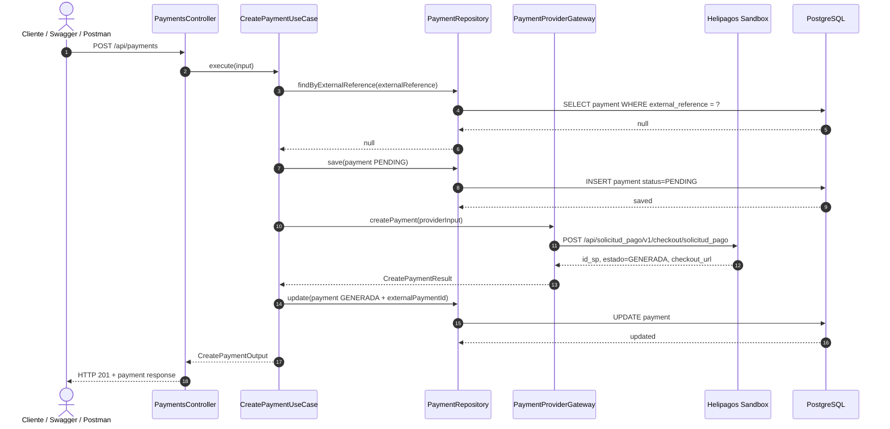
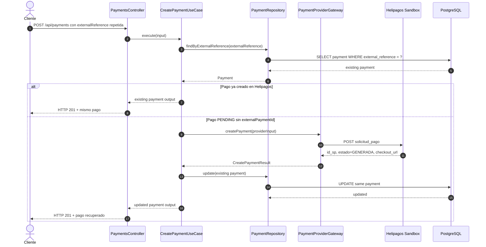
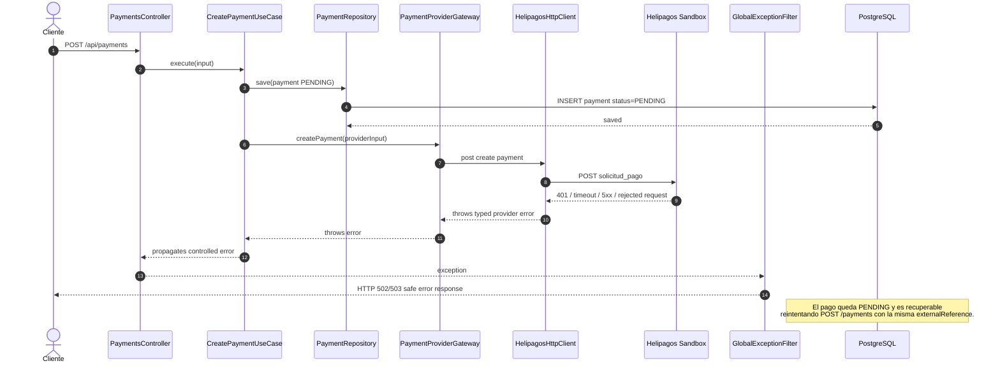
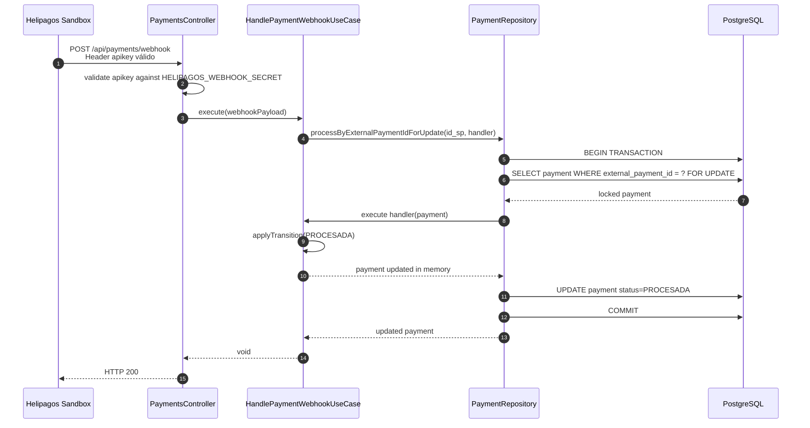
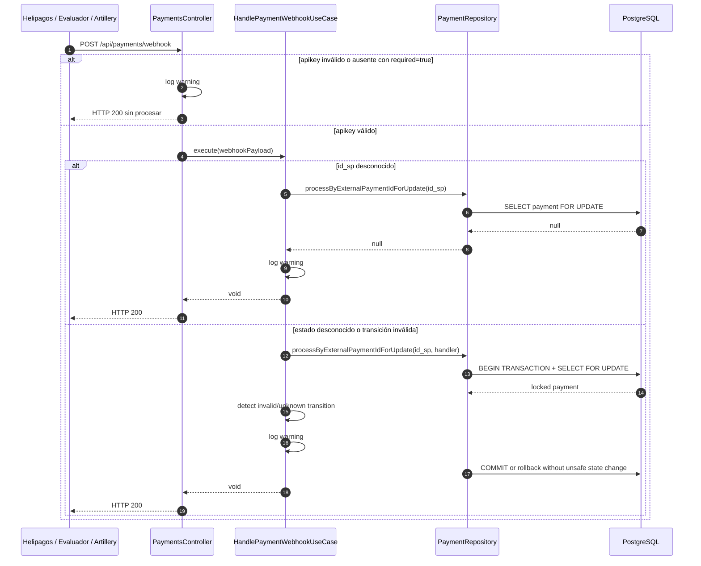
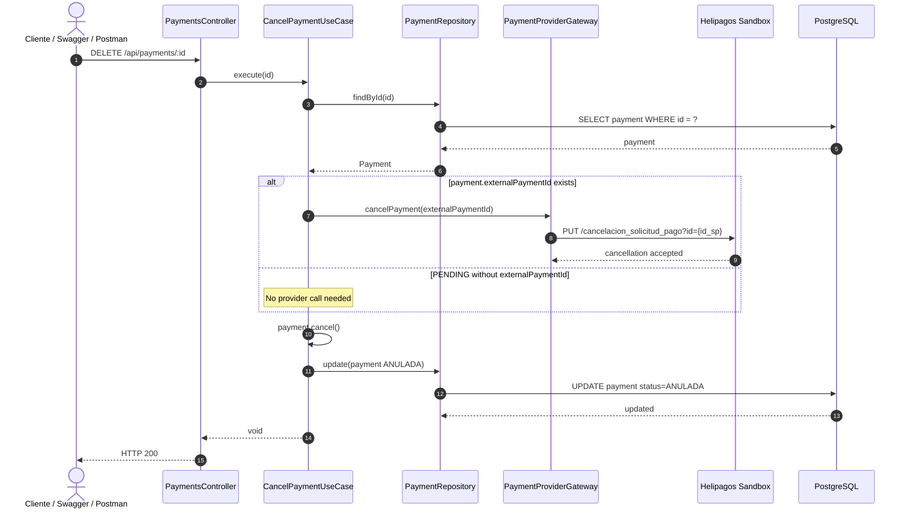
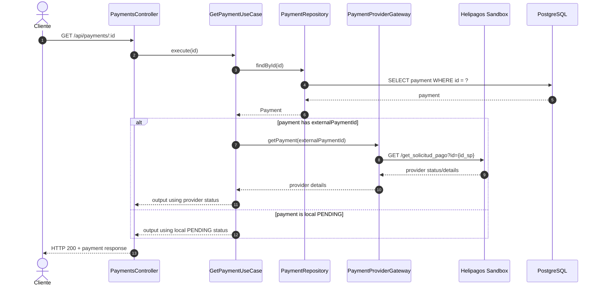
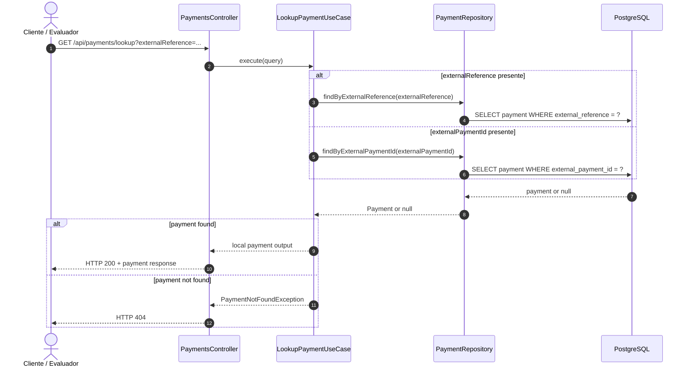
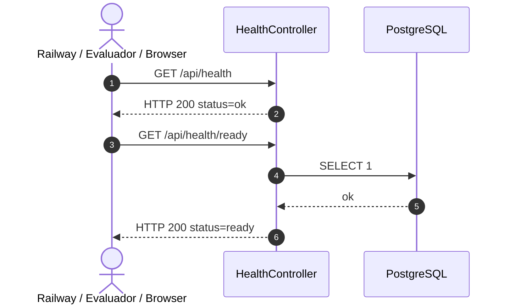

# Diagramas de secuencia — Helipagos Payments API

Este documento complementa `DESIGN.md` con diagramas Mermaid de los flujos principales del backend.

Los diagramas están escritos como Markdown para que GitHub los renderice automáticamente. También pueden editarse en [Mermaid Live Editor](https://mermaid.live/) copiando el contenido de cada bloque.

---

## 1. Creación de pago exitosa

---

## 2. Creación idempotente y recuperación de `PENDING`

---

## 3. Falla de Helipagos durante creación

---

## 4. Webhook válido con `apikey`

---

## 5. Webhook inválido, desconocido o duplicado

---

## 6. Cancelación de pago

---

## 7. Consulta de pago por ID interno

---

## 8. Lookup local por `externalReference` o `externalPaymentId`

---

## 9. Health checks

---
